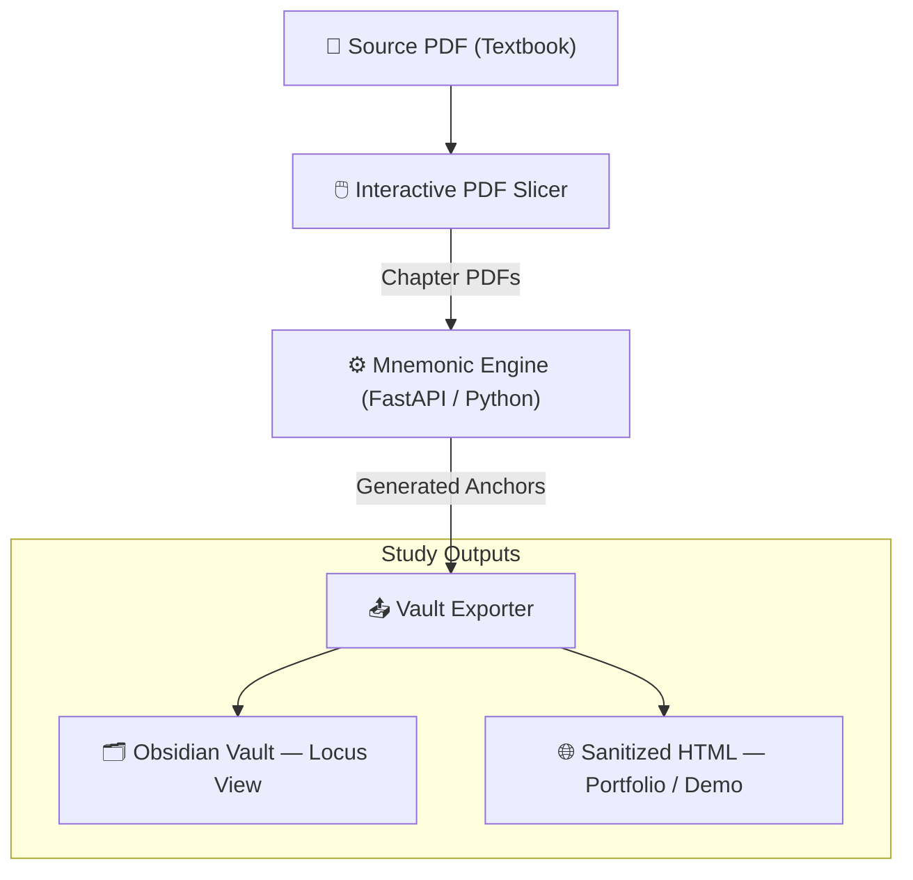

# Anti-Gravity Knowledge Engine (AGKE)

> *A personal study tool that transforms dense technical textbooks into long-term memory through sensory-anchored, narrative-driven mnemonics.*

---

## What Is This?

**AGKE** is a custom-built desktop application and note-taking pipeline designed to make studying for technical certifications (CompTIA Network+, Security+, etc.) more effective by exploiting how the human brain actually retains information.

Rather than re-reading dry textbook definitions, AGKE generates **grotesque, sensory-rich memory anchors** for each concept — pairing abstract networking protocols or security frameworks with vivid biological imagery and scent profiles that make the material impossible to forget.

The system is built for **personal, local-first use** and serves as the backbone of an ongoing self-study workflow. This page is a **public-facing demo** of the architecture and output format.

---

## Core Concept: Dissonance for Retention

The human memory is wired to retain the unusual, the emotionally charged, and the multi-sensory. AGKE exploits this by:

1. **Biological Kingdom Theming:** Each subject domain is paired with a distinct biological kingdom (e.g., Networking = Otters, Cybersecurity = Fungi). This creates distinct "memory territories" that prevent related concepts from bleeding into each other.

2. **Scent Anchoring:** Each kingdom carries a primary and secondary scent profile, creating a multi-channel sensory hook for recalling information (e.g., Networking chapters evoke ambrosia + ammonia).

3. **Narrative Characters:** A recurring protagonist anchors the study session in a fictional scenario, giving the learner a "story context" in which each concept plays a role.

4. **Collapsible Mnemonic Callouts:** Notes are written in Obsidian Markdown. The grotesque memory anchor for each concept is hidden inside a collapsible callout — invisible during review until intentionally revealed, acting as a self-quizzing mechanism.

---

## Architecture Overview



**Key components:**

| Component | Description |
| :--- | :--- |
| **Interactive PDF Slicer** | Browser-based tool using `pdf.js` + `pdf-lib` to slice a full textbook into chapter-sized PDFs visually — no server upload needed until slicing is complete |
| **Mnemonic Engine** | Python/FastAPI service that OCRs each chapter PDF and generates grotesque sensory anchors (visual, scent, logic) using per-subject biological kingdom profiles |
| **Mnemonics Editor** | In-browser 4-field editor (Acronym · Visual Anchor · Scent Profile · Logic Link) — users refine AI-generated anchors per section and chapter |
| **LLM Story Arc Generator** | Planned — chains chapter-level acrostic theme words into a unified hero's journey narrative using the Google Gemini API (local Ollama migration planned) |
| **Vault Exporter** | Writes Obsidian-compatible Markdown files with collapsible `[!abstract]-` callouts for each anchor; `_index.md` per chapter |
| **Anki Export** | Planned — tab-separated `.txt` flashcard deck (Front: chapter title; Back: story beat + source text); browser preview before download |
| **Sanitizer** | Planned — strips grotesque imagery and outputs clean HTML suitable for the public portfolio page |

---

## Example Note Output (Locus View — Obsidian)

The following is a representative example of a generated study note. The memory anchor callout is **collapsed by default** and revealed by the learner as a self-test:

```markdown
# The Layered Approach

> Reference models act as a conceptual blueprint for communications.
> Slicing functions into bound departments prevents protocols from
> needing to know details of other layers.

---

> [!abstract]- 🧠 Memory Anchor  ← collapsed; click to reveal
> **Imagery:** A bloated salamander sits atop the layered architecture, its eyes
> weeping packet drops. Each blink sends signals through its withering nervous system.
>
> **Scent:** Ambrosia — suffocatingly sweet, like wilting funeral flowers.
> Underneath, Ammonia stings — sharp like a reptile tank baking in the sun.
>
> **Logic:** The translucent newt is your trigger for The Layered Approach —
> just as its membrane decays in layers, so does this architecture operate.

---
*← Previous Chapter | Next Chapter →*
```

---

## Subject Profiles

Each subject domain studied with AGKE is assigned a unique sensory and narrative profile to maximise differentiation in memory:

| Subject | Biological Kingdom | Visual Aesthetic | Scent Profile | Narrative Voice |
| :--- | :--- | :--- | :--- | :--- |
| **Networking** | Amphibians / Otters | Withering, aquatic decay | Ambrosia + Ammonia | Space Operetta |
| **Databases** | Insects | Chitinous, swarming | Ozone + Sulfur | Cyberpunk Noir |
| **Cybersecurity** | Fungi | Parasitic, spore clouds | Truffle + Damp Copper | Survival Horror |
| **Algorithms** | Cephalopods | Shifting, ink-cloud | Brine + Iodine | Cosmic Horror |
| **Operating Systems** | Arachnids | Webbing, lurking | Petrichor + Formaldehyde | Gothic Horror |

---

## Technology Stack

This is a fully local, containerized application. No data leaves your machine.

| Layer | Technology |
| :--- | :--- |
| **Web GUI** | Vanilla HTML5, CSS3, JavaScript (ES6) |
| **PDF Processing (Client)** | `pdf.js` + `pdf-lib` (runs entirely in the browser) |
| **Backend** | Python 3.11, FastAPI, Uvicorn |
| **OCR** | PyMuPDF (`fitz`), Tesseract OCR (fallback for scanned PDFs) |
| **Note Format** | Obsidian Markdown with collapsible callouts |
| **Deployment** | Docker + Docker Compose |
| **Desktop Integration** | XDG `.desktop` launcher (KDE Plasma / Garuda Linux) |

---

## Project Status

This is an **active personal project** in ongoing development. Core pipeline (PDF ingestion → per-section mnemonic generation → Obsidian export) is fully functional for CompTIA Network+ study.

**Complete:**
- [x] Interactive client-side PDF slicer with visual page thumbnails and TOC bookmark extraction
- [x] Per-section grotesque mnemonic generation (visual anchor, scent anchor, logic link)
- [x] Chapter-level acrostic theme-word generation from title initials
- [x] In-browser Mnemonics Editor with 4-field sidebar and auto-derived acronym
- [x] Obsidian vault export with collapsible `[!abstract]-` callouts and section navigation
- [x] Revision history, favourites, document copy/move, section split/merge
- [x] KDE Plasma desktop launcher integration

**In Progress / Planned:**
- [ ] Multi-chapter story arc generator via Google Gemini API (hero's journey, scent-woven narrative)
- [ ] LLM abstraction layer for future local Ollama migration
- [ ] Anki flashcard export (tab-separated `.txt`, browser preview before download)
- [ ] GitHub Pages deployment of sanitized note summaries
- [ ] Additional subject profiles (Security+, Linux+, RHCSA)

---

## About

Built as part of a self-directed computer science certification study program. The mnemonic methodology draws on memory palace (method of loci) techniques combined with multi-sensory encoding theory.

> *This public page is a sanitized demo. The full local version contains personal study notes and private configuration.*

