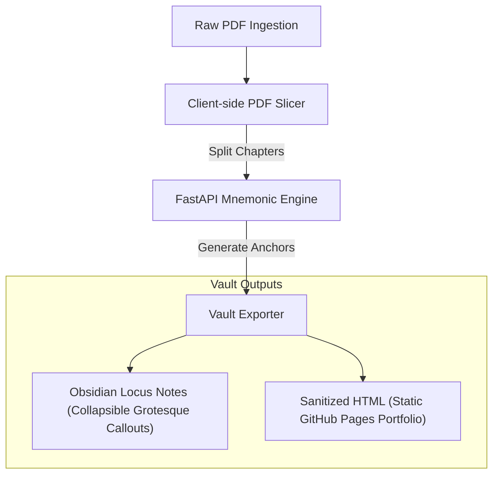

# Anti-Gravity Knowledge Engine (AGKE)
> **Grotesque Sensory Mnemonics & Cognitive Anchors for Computer Science Studies**

**Anti-Gravity** is a containerized, local-first knowledge ecosystem designed to bridge the gap between "Cold Data" (textbook pages) and "Living Knowledge" (sensory anchors). By applying cognitive dissonance—blending synthetic beauty with organic decay—AGKE encodes complex computer science abstractions into long-term human memory.

---

## 🖥️ This README — Desktop (Local) Version

This is the **full private README** for running AGKE on your local Arch Garuda Linux machine. It contains Docker setup, absolute paths, and internal tooling details.

> **For the sanitized public portfolio version, see [Readme-Public.md](./Readme-Public.md)**

---

## 🧬 Core Principles

### 1. Dissonance for Retention
Standard documentation fails because it is sterile and uniform. AGKE succeeds by being **grotesque**. By linking dry computational structures to visceral scent profiles (e.g., ambrosia and ammonia) and biological kingdom themes, we prevent "memory bleeding" between similar technical topics.

### 2. Dual-State Views (The Sanitizer Protocol)
The system maintains notes in two formats:
1. **Locus View (Obsidian):** The primary study format containing the original text, key terms, and collapsed memory anchors. By utilizing Obsidian's native collapsible syntax (`[!abstract]-`), mnemonics remain hidden until manually toggled open.
2. **Sanitized View (GitHub Pages):** A clean, production-ready output purged of grotesque visuals, presenting elegant summaries and interactive elements suitable for portfolios or public hosting.

---

## 🏗️ System Architecture



### 1. Client-Side Slicing Workspace
To handle book-scale documents without server overloading, splitting is performed in the web GUI using `pdf.js` and `pdf-lib`:
* **Auto-TOC Mapping:** Parses bookmarks to identify chapter divisions.
* **Manual Ranges:** Permits page selection via text input (e.g., `1-10, 11-20`) or by clicking page thumbnails.
* **Fixed Splits:** Divides files into uniform page-count chapters.

> **User Choice:** Before ingestion, you can either split the PDF yourself and upload chapter-by-chapter, or use the built-in Slicer Workspace to do it interactively in the browser.

### 2. Mnemonic Generation Pipeline
The core Python application in [mnemonic_engine/](./mnemonic_engine/) generates anchors using profiles in [book_config.yml](./mnemonic_engine/book_config.yml). Each epoch/subject has distinct properties:

| Subject | Biological Kingdom | Visual Aesthetic | Primary Scent | Secondary Scent | MC / Narrative Profile |
| :--- | :--- | :--- | :--- | :--- | :--- |
| **Networking** | Otters | Withering / Decaying | Ambrosia | Ammonia | *Newt* (Space Operetta) |
| **Databases** | Insects | Chitinous / Swarming | Ozone | Sulfur | *Draven* (Cyberpunk) |
| **Cybersecurity** | Fungi | Parasitic / Spores | Truffle | Damp Copper | *Calyra* (Survival Horror) |
| **Algorithms** | Cephalopods | Shifting / Ink-Cloud | Brine | Iodine | *Cosmic horror protagonist* |
| **Operating Systems** | Arachnids | Webbing / Lurking | Petrichor | Formaldehyde | *Gothic horror protagonist* |

---

## 📝 Example Note Layout (Locus View)

Notes exported to your [vault/](./vault/) follow the layout below:

```markdown
---
tags: [networking, study, mnemonic]
status: learning
mnemonic_type: grotesque
source_page: 3
created_at: 2026-06-11T15:42:00Z
---

> [!info] 📚 **Book:** [[_index|CompTIA Network+ Study Guide]]
> **Chapter:** The Layered Approach | **Page:** 3

# The Layered Approach

> Reference models act as a conceptual blueprint for communications. 
> Slicing functions into bound departments prevents protocols from 
> needing to know details of other layers.

---

> [!abstract]- 🧠 Memory Anchor: Translucent newts Layered Approach
> **Kingdom:** Amphibians
> 
> **The Imagery:**
> A bloated salamander sits atop the layered architecture, its eyes weeping packet drops. Each blink sends signals through its withering nervous system.
> 
> **The Scent Anchor:**
> Close your eyes. The Ambrosia fills the room, suffocatingly sweet like wilting funeral flowers. Underneath it, the Ammonia stings—sharp like a reptile tank baking in the sun.
> 
> **The Logic:**
> The translucent newt is your brain's trigger for **The Layered Approach**—just as its membrane decays in layers, so does this architecture operate.

---

*[[02 - Previous Chapter|← Previous]] | [[04 - Next Chapter|Next →]]*
```

---

## 🚀 Deployment & Installation (Local / Arch Garuda Linux)

### 1. Pre-requisites
Ensure `docker` and `docker-compose` are installed and running on your system.

```bash
sudo pacman -S docker docker-compose
sudo systemctl enable --now docker
```

### 2. Desktop Launcher (One-Time Setup)
AGKE ships with an automation script that builds and installs the KDE Plasma application launcher:

```bash
./scripts/install_launcher.sh
```

This script:
1. Escapes spaces in the project path for `.desktop` spec compliance.
2. Marks the launcher as trusted (via `gio`) for KDE Plasma.
3. Registers the app in `~/.local/share/applications/` and copies a shortcut to `~/Desktop/`.
4. Updates the desktop applications database.

> If the Desktop icon still shows as **untrusted**, right-click it and select **"Allow Launching"** in the KDE Plasma context menu.

### 3. How the Launch Works
Clicking the icon runs [scripts/launch.sh](./scripts/launch.sh), which:
1. Validates that the Docker service is active (starts it if needed).
2. Runs the container stack via `docker compose up -d`.
3. Polls the backend health check at `http://localhost:8000/api/health`.
4. Automatically opens the client GUI in your default browser at `http://localhost:8000`.

### 4. Manual Startup
To run the containers manually without the launcher:

```bash
docker compose up -d --build
```

---

## 📚 Ingesting a New Book

### Option A — Pre-split Before Upload (Recommended for large PDFs)
Split your PDF into chapter-sized files yourself (e.g., using `pdftk` or any PDF editor) before uploading:

```bash
pdftk source.pdf cat 1-30 output chapter_01.pdf
pdftk source.pdf cat 31-55 output chapter_02.pdf
# ...then upload each file via the web GUI
```

### Option B — Use the Built-in Interactive Slicer
Upload the full PDF to the GUI and use the **Slicer Workspace** to:
1. Inspect the auto-extracted Table of Contents (bookmarks).
2. Preview page thumbnails and adjust chapter boundaries visually.
3. Define manual page ranges (e.g., `1-30, 31-55`).
4. Click **Process & Upload** to slice and ingest the chapters in one step.

---

## 🛠️ Technology Stack

* **Client Browser App:** Vanilla HTML5, CSS3 (BookStack dark theme), JS (ES6)
* **Client PDF Engine:** `pdf.js` (Visual page thumbnails & TOC extraction), `pdf-lib` (Local page slicing)
* **Backend API Server:** Python 3.11, FastAPI, Uvicorn
* **PDF OCR Engine:** PyMuPDF (`fitz`), Tesseract OCR (Fallback for scanned pages)
* **Containerization:** Docker & Docker Compose
* **Note Format:** Obsidian Markdown with collapsible callouts (`[!abstract]-`)

---

## 🗂️ Repository Structure

```
Memory Vault/
├── mnemonic_engine/         # Python FastAPI backend + Web GUI static assets
│   ├── static/              # index.html, app.js, styles.css, icon.png
│   ├── main.py              # FastAPI app entry point
│   ├── engine.py            # Mnemonic generation core
│   ├── exporter.py          # Obsidian / HTML vault exporter
│   └── book_config.yml      # Per-subject narrative profiles
├── data/
│   ├── uploads/             # Raw and pre-split PDF chapters
│   └── processed/           # Intermediate OCR text output
├── vault/                   # Generated Obsidian notes (the Locus View)
├── scripts/
│   ├── launch.sh            # Docker lifecycle + browser opener
│   └── install_launcher.sh  # KDE Plasma desktop integration
├── memory-vault.desktop     # .desktop entry template
├── docker-compose.yml
└── Readme.md                # This file (private, local)
    Readme-Public.md         # Sanitized public/portfolio version
```