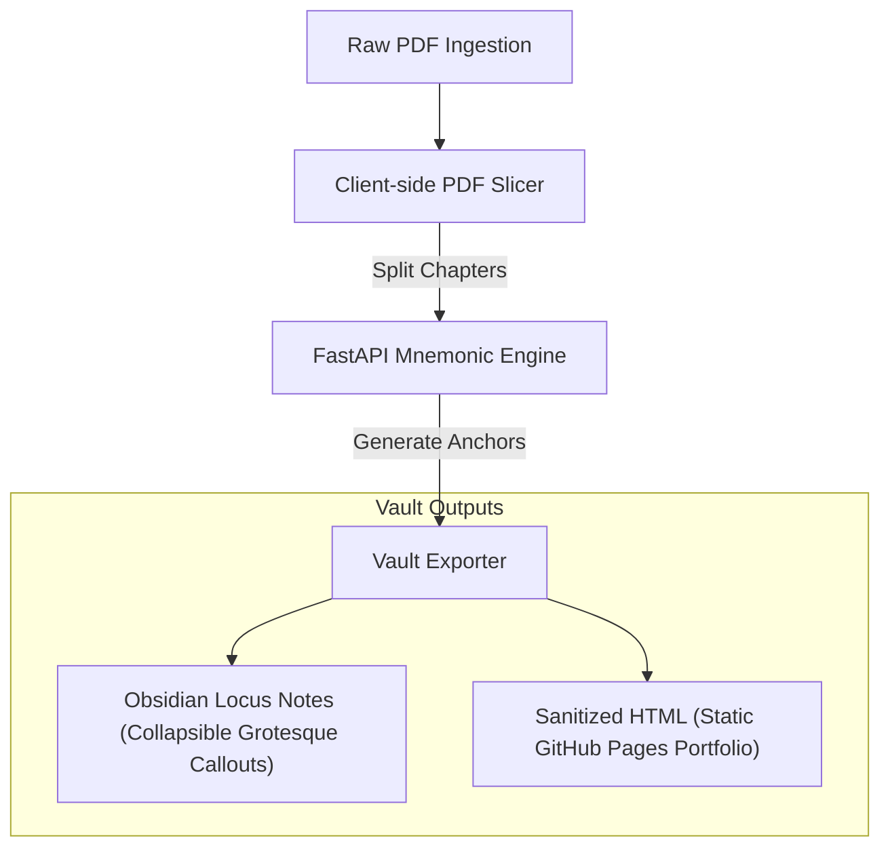

# Anti-Gravity Knowledge Engine (AGKE)
> **Grotesque Sensory Mnemonics & Cognitive Anchors for Computer Science Studies**

**Anti-Gravity** is a containerized, horizontally scalable knowledge ecosystem designed to bridge the gap between "Cold Data" (textbook pages) and "Living Knowledge" (sensory anchors). By applying cognitive dissonance—blending synthetic beauty with organic decay—AGKE encodes complex computer science abstractions into long-term human memory.

---

## 🧬 Core Principles

### 1. Dissonance for Retention
Standard documentation fails because it is sterile and uniform. AGKE succeeds by being **grotesque**. By linking dry computational structures to visceral scent profiles (e.g., ambrosia and ammonia) and biological kingdom themes, we prevent "memory bleeding" between similar technical topics.

### 2. Dual-State Views (The Sanitizer Protocol)
The system maintains notes in two formats:
1. **Locus View (Obsidian):** The primary study format containing the original text, key terms, and collapsed memory anchors. By utilizing Obsidian's native collapsible syntax (`[!abstract]-`), mnemonics remain hidden until manually toggled open.
2. **Sanitized View (GitHub Pages):** A clean, production-ready output purged of grotesque visuals, presenting elegant summaries and interactive elements suitable for portfolios or public hosting.

---

## 🏗️ System Architecture



### 1. Client-Side Slicing Workspace
To handle book-scale documents without server overloading, splitting is performed in the web GUI using `pdf.js` and `pdf-lib`:
* **Auto-TOC Mapping:** Parses bookmarks to identify chapter divisions.
* **Manual Ranges:** Permits page selection via text input (e.g., `1-10, 11-20`) or by clicking page thumbnails.
* **Fixed Splits:** Divides files into uniform page count chapters.

### 2. Mnemonic Generation Pipeline
The core Python application in [mnemonic_engine/](file:///home/hyro_antares/Documents/Repositories/Projects/Memory%20Vault/mnemonic_engine/) generates anchors using profiles in [book_config.yml](file:///home/hyro_antares/Documents/Repositories/Projects/Memory%20Vault/mnemonic_engine/book_config.yml). Each epoch/subject has distinct properties:

| Subject | Biological Kingdom | Visual Aesthetic | Primary Scent | Secondary Scent | MC / Narrative Profile |
| :--- | :--- | :--- | :--- | :--- | :--- |
| **Networking** | Amphibians | Withering / Decaying | Ambrosia | Ammonia | *Newt* (Space Operetta) |
| **Databases** | Insects | Chitinous / Swarming | Ozone | Sulfur | *Draven* (Cyberpunk) |
| **Cybersecurity** | Fungi | Parasitic / Spores | Truffle | Damp Copper | *Calyra* (Survival Horror) |
| **Algorithms** | Cephalopods | Shifting / Ink-Cloud | Brine | Iodine | *Cosmic horror protagonist* |
| **Operating Systems** | Arachnids | Webbing / Lurking | Petrichor | Formaldehyde | *Gothic horror protagonist* |

---

## 📝 Example Note Layout (Locus View)

Notes exported to your [vault/](file:///home/hyro_antares/Documents/Repositories/Projects/Memory%20Vault/vault/) follow the layout below:

```markdown
---
tags: [networking, study, mnemonic]
status: learning
mnemonic_type: grotesque
source_page: 3
created_at: 2026-06-11T15:42:00Z
---

> [!info] 📚 **Book:** [[_index|CompTIA Network+ Study Guide]]
> **Chapter:** The Layered Approach | **Page:** 3

# The Layered Approach

> Reference models act as a conceptual blueprint for communications. 
> Slicing functions into bound departments prevents protocols from 
> needing to know details of other layers.

---

> [!abstract]- 🧠 Memory Anchor: Translucent newts Layered Approach
> **Kingdom:** Amphibians
> 
> **The Imagery:**
> A bloated salamander sits atop the layered approach architecture, its eyes weeping packet drops. Each blink sends signals through its withering nervous system.
> 
> **The Scent Anchor:**
> Close your eyes. The Ambrosia fills the room, suffocatingly sweet like wilting funeral flowers. Underneath it, the Ammonia stings—sharp like a reptile tank baking in the sun.
> 
> **The Logic:**
> The translucent newt is your brain's trigger for **The Layered Approach**—just as its membrane decays in layers, so does this architecture operate.

---

*[[02 - Previous Chapter|← Previous]] | [[04 - Next Chapter|Next →]]*
```

---

## 🚀 Deployment & Installation

### 1. Pre-requisites
Ensure `docker` and `docker-compose` are installed and running on your system.

### 2. Arch Garuda Linux Desktop Launcher
AGKE comes with an automation script to build and install an application menu launcher shortcut:

```bash
# Register the application launcher in ~/.local/share/applications/
./scripts/install_launcher.sh
```

This registers the launcher pointing to the startup controller [scripts/launch.sh](file:///home/hyro_antares/Documents/Repositories/Projects/Memory%20Vault/scripts/launch.sh), which:
1. Validates that the Docker service is active.
2. Runs the container stack.
3. Polls the backend health check.
4. Automatically opens the client GUI in your browser at `http://localhost:8000`.

### 3. Manual Startup
To run the containers manually:

```bash
docker compose up -d --build
```

---

## 🛠️ Technology Stack

* **Client Browser App:** Vanilla HTML5, CSS3 (BookStack dark theme aesthetics), JS (ES6)
* **Client PDF Engine:** `pdf.js` (Visual page thumbnails & TOC extraction), `pdf-lib` (Local page slicing/extraction)
* **Backend API server:** Python 3.11, FastAPI, Uvicorn
* **PDF OCR Engine:** PyMuPDF (`fitz`), Tesseract OCR (Fallback for scanned pages)
* **Containerization:** Docker & Docker Compose