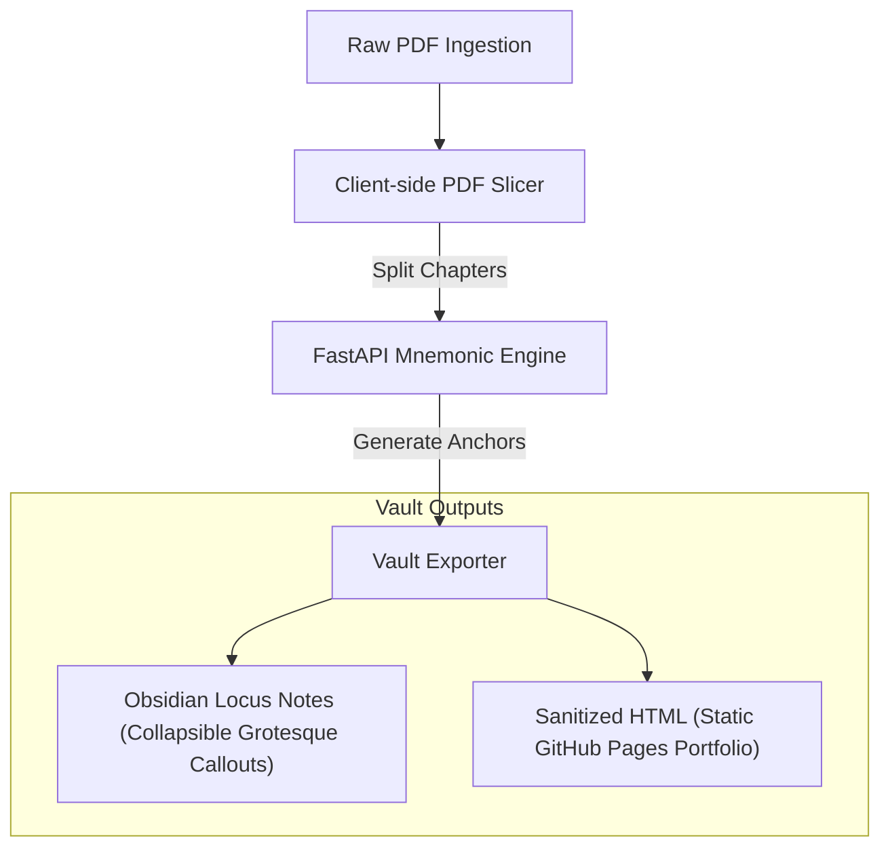

# Anti-Gravity Knowledge Engine (AGKE)

> **Grotesque Sensory Mnemonics & Cognitive Anchors for Computer Science Studies**

**Anti-Gravity** is a containerized, local-first knowledge ecosystem designed to bridge the gap between "Cold Data" (textbook pages) and "Living Knowledge" (sensory anchors). By applying cognitive dissonance—blending synthetic beauty with organic decay—AGKE encodes complex computer science abstractions into long-term human memory.

---

> 🤖 **ATTENTION AI AGENTS:** You MUST read [AI_RULES.md](./AI_RULES.md) before making any modifications to this repository. All agents are required to update the project Knowledge Graph upon completing milestones or before pushing structural changes.

---

## This README — Desktop (Local) Version

This is the **full private README** for running AGKE on your local Arch Garuda Linux machine. It contains Docker setup, absolute paths, and internal tooling details.

> **For the sanitized public portfolio version, see [Readme-Public.md](./Readme-Public.md)**

---

## 🧬 Core Principles

### 1. Dissonance for Retention

Standard documentation fails because it is sterile and uniform. AGKE succeeds by being **grotesque**. By linking dry computational structures to visceral scent profiles (e.g., ambrosia and ammonia) and biological kingdom themes, we prevent "memory bleeding" between similar technical topics.

### 2. Dual-State Views (The Sanitizer Protocol)

The system maintains notes in two formats:

1. **Locus View (Obsidian):** The primary study format containing the original text, key terms, and collapsed memory anchors. By utilizing Obsidian's native collapsible syntax (`[!abstract]-`), mnemonics remain hidden until manually toggled open.
2. **Sanitized View (GitHub Pages):** A clean, production-ready output purged of grotesque visuals, presenting elegant summaries and interactive elements suitable for portfolios or public hosting.

---

## System Architecture



### 1. Client-Side Slicing Workspace

To handle book-scale documents without server overloading, splitting is performed in the web GUI using `pdf.js` and `pdf-lib`:

* **Auto-TOC Mapping:** Parses bookmarks to identify chapter divisions.
* **Manual Ranges:** Permits page selection via text input (e.g., `1-10, 11-20`) or by clicking page thumbnails.
* **Fixed Splits:** Divides files into uniform page-count chapters.

> **User Choice:** Before ingestion, you can either split the PDF yourself and upload chapter-by-chapter, or use the built-in Slicer Workspace to do it interactively in the browser.

### 2. Mnemonic Generation Pipeline

The core Python application in [mnemonic_engine/](./mnemonic_engine/) generates anchors using profiles in [book_config.yml](./mnemonic_engine/book_config.yml). Each epoch/subject has distinct properties, each property but subject is generated and user approved before mnemonic generation:

| Subject                                          | Biological Kingdom animal | Visual Aesthetic     | Primary Scent | Secondary Scent | MC / Narrative Profile        | plot                                      |
| :----------------------------------------------- | :------------------------ | :------------------- | :------------ | :-------------- | :---------------------------- | :---------------------------------------- |
| **Networking +**                           | Otters                    | Withering / Decaying | Ambrosia      | Ammonia         | *Newt* (Space Operetta)     | Controlling planet for drug runs in space |
| **Databases (Under Construction)**         | Insects                   | Chitinous / Swarming | Ozone         | Sulfur          | *Draven* (Cyberpunk)        | (tbd)                                     |
| **Cybersecurity (Under Construction)**     | Fungi                     | Parasitic / Spores   | Truffle       | Damp Copper     | *Calyra* (Survival Horror)  | (tbd)                                     |
| **Algorithms (Under Construction)**        | Cephalopods               | Shifting / Ink-Cloud | Brine         | Iodine          | *Cosmic horror protagonist* | (tbd)                                     |
| **Operating Systems (Under Construction)** | Arachnids                 | Webbing / Lurking    | Petrichor     | Formaldehyde    | *Gothic horror protagonist* | (tbd)                                     |

---

## 📝 Example Note Layout (Locus View)

Notes exported to your [vault/](./vault/) follow the layout below:

```markdown
---
tags: [networking, study, mnemonic]
status: learning
mnemonic_type: grotesque
source_page: 3
created_at: 2026-06-11T15:42:00Z
---

> [!info] **Book:** [[_index|CompTIA Network+ Study Guide]]
> **Chapter:** The Layered Approach | **Page:** 3

# The Layered Approach

> Reference models act as a conceptual blueprint for communications. 
> Slicing functions into bound departments prevents protocols from 
> needing to know details of other layers.

---

> [!abstract]- Memory Anchor: Translucent newts Layered Approach
> **Kingdom:** Amphibians
> 
> **The Imagery:**
> A bloated salamander sits atop the layered architecture, its eyes weeping packet drops. Each blink sends signals through its withering nervous system.
> 
> **The Scent Anchor:**
> Close your eyes. The Ambrosia fills the room, suffocatingly sweet like wilting funeral flowers. Underneath it, the Ammonia stings—sharp like a reptile tank baking in the sun.
> 
> **The Logic:**
> The translucent newt is your brain's trigger for **The Layered Approach**—just as its membrane decays in layers, so does this architecture operate.

---

*[[02 - Previous Chapter|← Previous]] | [[04 - Next Chapter|Next →]]*
```

---

## 🚀 Deployment & Installation (Local / Arch Garuda Linux)

### 1. Pre-requisites

Ensure `docker` and `docker-compose` are installed and running on your system.

```bash
sudo pacman -S docker docker-compose
sudo systemctl enable --now docker
```

### 2. Desktop Launcher (One-Time Setup)

AGKE ships with an automation script that builds and installs the KDE Plasma application launcher:

```bash
./scripts/install_launcher.sh
```

This script:

1. Escapes spaces in the project path for `.desktop` spec compliance.
2. Marks the launcher as trusted (via `gio`) for KDE Plasma.
3. Registers the app in `~/.local/share/applications/` and copies a shortcut to `~/Desktop/`.
4. Updates the desktop applications database.

> If the Desktop icon still shows as **untrusted**, right-click it and select **"Allow Launching"** in the KDE Plasma context menu.

### 3. How the Launch Works

Clicking the icon runs [scripts/launch.sh](./scripts/launch.sh), which:

1. Validates that the Docker service is active (starts it if needed).
2. Runs the container stack via `docker compose up -d`.
3. Polls the backend health check at `http://localhost:8000/api/health`.
4. Automatically opens the client GUI in your default browser at `http://localhost:8000`.

### 4. Manual Startup

To run the containers manually without the launcher:

```bash
docker compose up -d --build
```

---

## 📚 Ingesting a New Book

### Option A — Local Batch Ingest (Fastest — pre-split already done)

Click **⚡ Load All Networking Chapters** in the Upload view. The engine reads the 25 pre-split Sybex chapter PDFs directly from disk and assigns rigid canonical names (`Chapter 01 — Introduction to Networks`, etc.). No manual upload required.

### Option B — Pre-split Before Upload

Split your PDF into chapter-sized files yourself (e.g., using `pdftk`) before uploading:

```bash
pdftk source.pdf cat 1-30 output chapter_01.pdf
pdftk source.pdf cat 31-55 output chapter_02.pdf
# ...then upload each file via the web GUI
```

### Option C — Use the Built-in Interactive Slicer

Upload the full PDF to the GUI and use the **Slicer Workspace** to:

1. Inspect the auto-extracted Table of Contents (bookmarks).
2. Preview page thumbnails and adjust chapter boundaries visually.
3. Define manual page ranges (e.g., `1-30, 31-55`).
4. Click **Process & Upload** to slice and ingest the chapters in one step.

---

## 🛠️ Technology Stack

* **Client Browser App:** Vanilla HTML5, CSS3 (BookStack dark theme), JS (ES6)
* **Client PDF Engine:** `pdf.js` (Visual page thumbnails & TOC extraction), `pdf-lib` (Local page slicing)
* **Backend API Server:** Python 3.11, FastAPI, Uvicorn
* **PDF OCR Engine:** PyMuPDF (`fitz`), Tesseract OCR (Fallback for scanned pages)
* **Containerization:** Docker & Docker Compose
* **Note Format:** Obsidian Markdown with collapsible callouts (`[!abstract]-`)
* **Notifications:** Web Notifications API (browser popup on ingest completion)

---

## 🗂️ Repository Structure

```
Memory Vault/
├── mnemonic_engine/         # Python FastAPI backend + Web GUI static assets
│   ├── static/              # index.html, app.js, styles.css, icon.png
│   ├── main.py              # FastAPI app entry point
│   ├── engine.py            # Mnemonic generation core
│   ├── exporter.py          # Obsidian / HTML vault exporter
│   └── book_config.yml      # Per-subject narrative profiles
├── data/
│   ├── uploads/             # Raw and pre-split PDF chapters
│   └── processed/           # Intermediate OCR text output
├── vault/                   # Generated Obsidian notes (the Locus View)
├── scripts/
│   ├── launch.sh            # Docker lifecycle + browser opener
│   └── install_launcher.sh  # KDE Plasma desktop integration
├── memory-vault.desktop     # .desktop entry template
├── docker-compose.yml
└── Readme.md                # This file (private, local)
    Readme-Public.md         # Sanitized public/portfolio version
```


# 🧠 The Overall Experience — Mnemonic Engine Design Philosophy

This section defines the intended user experience and cognitive workflow AGKE facilitates.
It is the canonical design reference for all mnemonic generation features.

---

## Step 1 — Choose the Right Mnemonic Method

The engine selects the best technique based on the title structure and content density
of each section. The methods, in order of preference:

### 🔤 Acronyms *(if the initials form a pronounceable word)*

Combine the first letters of words to form a new, easy-to-remember word.

> *Example:* **HOMES** — Lake **H**uron, **O**ntario, **M**ichigan, **E**rie, **S**uperior
> [[Wikipedia](https://en.wikipedia.org/wiki/Mnemonic)]

### 📜 Acrostics *(primary method for chapter / section titles)*

Use the first letter of each key word in the title to construct a complete, memorable
sentence or themed word set.

> *Example:* **P**lease **E**xcuse **M**y **D**ear **A**unt **S**ally
> → Parentheses, Exponents, Multiply, Divide, Add, Subtract
> [[Stanford CTL](https://ctl.stanford.edu/memory-strategy-mnemonics)]

**AGKE's use:** Acrostics are the *spine* of the chapter-level story. The first letters
of each word in a chapter or section title become the theme words. These themes are then
woven into a single **arching hero's journey narrative** that covers the entire chapter
or study unit. The title, the section headings, and user-defined key features of the
book all feed into this construction.

### 🔗 Linking / Chaining *(used for multi-chapter story arcs)*

Create a bizarre, absurd, interconnected story where each beat cues the next item in
the sequence. [[VeryWell Health](https://www.verywellhealth.com/memory-tip-1-keyword-mnemonics-98466)]

**AGKE's use:** After acrostics are generated per-chapter, the theme word sets from
multiple chapters are **chained into a single unified story** (see Step 4). Each chapter's
acrostic themes become a distinct act of the narrative.

### 🎵 Rhymes & Songs *(optional / user-initiated)*

Put the information to a catchy, rhythmic beat or familiar nursery rhyme pattern.
[[Wikipedia](https://en.wikipedia.org/wiki/Mnemonic),
[Learvo](https://www.learvo.com/Blog/creating-effective-mnemonic-phrases-for-memory)]

---

## Step 2 — Best Practices for Creation

* **Keep it short:** The mnemonic should not be harder to recall than the original information.
* **Use vivid imagery:** Imagine absurd or emotionally charged scenarios to anchor the memory.
  The more grotesque, the better it sticks.
* **Make it personal:** Words and references tied to your own life or interests survive long-term.
  [[Stanford CTL](https://ctl.stanford.edu/memory-strategy-mnemonics)]
* **The profile shapes the fiction:** For textbooks, the imaginary content is constrained by the
  **book's biological kingdom, scent profile, and MC profile** — this prevents memory bleed
  between subjects and keeps each chapter's anchor unique.

---

## Step 3 — Per-Section Mnemonic Note (The Locus View)

Each section within a chapter generates its own **Memory Anchor** in the Obsidian vault.
The note is shaped by the book's kingdom, aesthetic, and scent profile:

```markdown
---
tags: [networking, study, mnemonic]
status: learning
mnemonic_type: grotesque
source_page: 3
created_at: 2026-06-11T15:42:00Z
---

> [!info] **Book:** [[Beaver Dam Irrigation]]
> **Chapter 1: Fluid Movement — Environmental Study on Rivers Ecology** | **Page:** 3

# The Layered Approach

---

> [!abstract]- Memory Anchor: Translucent Beavers — Layered Approach
> **Kingdom:** Castor
> **Themes:** Morally grey, Alchemy
>
> **The Imagery:**
> A bloated beaver sits atop the layered architecture of rivers, its eyes weeping and
> changing tides. Each blink sends tidal waves through its withering tree system,
> matted against its face.
>
> **The Scent Anchor:**
> Close your eyes. The Ambrosia fills the room — suffocatingly sweet, like wilting
> funeral flowers. Underneath it, the Ammonia stings — sharp, like a rotting fish
> baking in the sun.
>
> **The Logic:**
> The bloated beaver is your brain's trigger for **[Chapter 1 / Section Title: key
> concept]** — just as its tears flow, so does fluid movement environmental study
> on rivers ecology.
```

---

## Step 4 — Chapter-Level Acrostic → Theme Words → Unified Story

This is the **core cognitive pipeline** of AGKE. Each chapter title's initials become
scaffolding for a themed word set, and those word sets chain into a single story arc.

### 4.1 — Extract Theme Words from Chapter Titles

| Chapter | Title | Initials | Acrostic Theme Words |
|:--|:--|:--|:--|
| Ch. 1 | Fluid Movement Environmental Study on Rivers Ecology | `[F,M,E,S,O,R,E]` | **F**ocus, **M**otivation, **E**nergy, **S**ynergy, **O**ptimism, **R**esilience, **E**xcellence |
| Ch. 2 | Understanding the Basics of Field Work in a Beaver Dam | `[U,T,B,O,F,W,I,A,B,D]` | **U**nity, **T**rust, **B**ravery, **O**pportunity, **F**ocus, **W**isdom, **I**nnovation, **A**ction, **B**alance, **D**edication |
| Ch. 3 | Losing Fluid Lucidity of the River Health | `[L,F,L,O,T]` | **L**eadership, **F**ocus, **L**earning, **O**penness, **T**enacity |

### 4.2 — Construct the AI Story Prompt

Once theme word sets are assembled, AGKE constructs the following prompt for story generation:

```
Create a short story using the following sequential theme sets:

  Chapter 1: Focus, Motivation, Energy, Synergy, Optimism, Resilience, Excellence
  Chapter 2: Unity, Trust, Bravery, Opportunity, Focus, Wisdom, Innovation, Action, Balance, Dedication
  Chapter 3: Leadership, Focus, Learning, Openness, Tenacity

Rules:
- Hit each theme word in order. Go sequentially through chapters.
- The story must be about a beaver learning about beaver dam irrigation.
- Make each story beat absurd and visceral to maximize memorability.
- Weave in the primary scent [Ambrosia] and secondary scent [Ammonia] to accent
  or undercut each story beat.
- The story must follow the Hero's Journey arc.
- The protagonist must be morally grey — not a hero, not a villain.
```

### 4.3 — AI-Generated Story Output (Example)

```
Barnaby the Beaver lived in a lodge that smelled perpetually of sweet, cloying Ambrosia,
a byproduct of the enchanted wood he chewed. He was an engineer of unparalleled, albeit
neurotic, caliber.

### The Call to Action

Barnaby's creek was drying up, caused by a rival's upstream obstruction. His Focus was
shattered by panic; his Energy plummeted. He lacked the Motivation to move until an
ancient, one-eyed muskrat named Silas — a morally grey mentor with breath like stinging
Ammonia — appeared. Silas promised to teach him "Hydraulic Alchemy," provided Barnaby
accepted that "efficiency justifies the ends."

### The Journey of Virtues

Silas led him to the High Dam, where they practiced Unity with the river's flow and Trust
in the unstable mud. When a flash flood hit, Barnaby showed Bravery by diving into the
silt, smelling the sharp, biting Ammonia of stagnant runoff, which he used to cauterize a
breach in the dam. He saw an Opportunity to divert the flow, using his Focus to calculate
the angles, drawing on the Wisdom of the elders, and sparking an Innovation that turned
the dam into an irrigation pump. He took immediate Action, maintaining a fragile Balance
between the river's rage and his construction, driven by pure Dedication.

### The Climax of Leadership

To finish the irrigation system, Barnaby had to sabotage the downstream sanctuary of a
rival colony to save his own. He paused, feeling the overwhelming, nauseatingly sweet
scent of Ambrosia rising from his tools, clashing with the harsh Ammonia of his deceit.
He realized true Leadership required Focus on the survival of his kin, continuous
Learning from his mistakes, Openness to the harsh reality of his choices, and the
Tenacity to live with the cost.

### Resolution

The water flowed. His colony thrived. The smell of Ambrosia lingered in the air, masking
the bitter, stinging Ammonia of the ecosystem he had quietly dismantled to ensure his own
excellence. He sat atop his dam, a master of a lonely, efficient empire, wondering if the
synergy of his success was worth the silence of the creek below.
```

---

## Step 5 — Anki Flashcard Generation

The unified story and per-section notes are exported as Anki-compatible flashcards.
Each card maps a chapter title to its mnemonic story beat, backed by actual source text.

### Card Format (Default)

```
[Front]
Chapter 1: Fluid Movement — Environmental Study on Rivers Ecology

[Back]
==== Mnemonic ====
Silas led him to the High Dam, where they practiced Unity with the river's flow and Trust
in the unstable mud. When a flash flood hit, Barnaby showed Bravery by diving into the
silt, smelling the sharp, biting Ammonia of stagnant runoff, which he used to cauterize a
breach in the dam. He saw an Opportunity to divert the flow, using his Focus to calculate
the angles, drawing on the Wisdom of the elders, and sparking an Innovation that turned
the dam into an irrigation pump. He took immediate Action, maintaining a fragile Balance
between the river's rage and his construction, driven by pure Dedication.

==== Actual Information ====
[Source text extracted from the chapter]
```

---

## 🗺️ Implementation Status

| Feature | Status | Notes |
|:--|:--|:--|
| Acronym auto-extraction from section/chapter titles | ✅ Done | `app.js → loadMnemonicsToSidebar()` |
| Per-section grotesque visual anchor generation | ✅ Done | `engine.py → generate()` |
| Per-section scent anchor generation | ✅ Done | `engine.py → _build_scent()` |
| Chapter-level acrostic word generation | ✅ Done | `engine.py → generate_chapter()` |
| Acronym Anchor box auto-populated in UI editor | ✅ Done | `app.js → loadMnemonicsToSidebar()` |
| `generate_chapter()` scent + logic placeholders | 🔧 Fix needed | `engine.py` lines 260 & 263 — replace with real calls |
| `visual_keywords` field in `book_config.yml` | 🔧 Fix needed | Field missing from all profiles; logic link falls back to "the creature" |
| Duplicate functions in `app.js` | 🔧 Fix needed | `setupUploadZone`, `requestNotificationPermission`, `pollProgress` each defined twice |
| Multi-chapter theme word aggregation (`POST /api/story/generate`) | 🔄 Planned | New `api/routes/story.py` route needed |
| LLM abstraction layer (`core/llm_client.py`) | 🔄 Planned | **Provider: Google Gemini API** (`gemini-1.5-flash`); `GEMINI_API_KEY` env var; `OllamaClient` stub for future local migration |
| AI story prompt construction (hero's journey, scent-woven) | 🔄 Planned | Prompt template defined in Readme.md § 4.2 |
| Story arc UI (chapter multi-select + display + save) | 🔄 Planned | New Story Arc tab/modal in document view |
| Anki card export | 🔄 Planned | **Format: tab-separated `.txt`** — browser-preview modal before download; `GET /api/documents/{id}/export/anki` |
| Unified story saved to Obsidian `_index.md` as `[!story]-` callout | 🔄 Planned | `services/exporter.py` extension |
| Sanitized HTML export (GitHub Pages / portfolio) | 🔄 Planned | `services/html_exporter.py` — strips grotesque callouts |

### 🔑 Architecture Decisions (Locked)

| Decision | Choice | Rationale |
|:--|:--|:--|
| **LLM provider** | Google Gemini API → Ollama (later) | Gemini now for quality; Ollama when stable for offline/local operation |
| **LLM abstraction** | `core/llm_client.py` base class | Provider swap = config change only, no rewrite |
| **Anki export format** | Tab-separated `.txt` | No new deps, no Docker rebuild; user edits in browser `<textarea>` before download |
