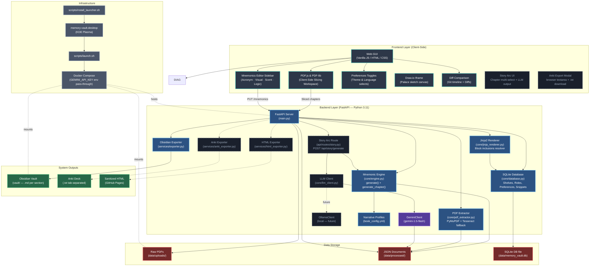

# Anti-Gravity Mnemonic Engine — IT Knowledge Graph

> **Last Updated:** 2026-06-29
> **Maintained by:** AI agents per [`AI_RULES.md`](../AI_RULES.md) — update after every milestone or structural change.

This document is the canonical in-repository architectural reference for the **Anti-Gravity Knowledge Engine (AGKE / Memory Vault)**. The full version with component tables and pipeline diagrams lives in the [AI Knowledge Item](../../../.gemini/antigravity-ide/knowledge/project_architecture/artifacts/knowledge_graph.md).

---

## System Architecture

> **Solid lines** = implemented and working. **Dashed lines** = planned / not yet built.

---

## Component Breakdown

### 1. Frontend Layer (`mnemonic_engine/static/`)

- **Web GUI** (`app.js`): Library, Upload, Document viewer, Profiles views
- **Slicer Workspace**: PDF.js thumbnails + TOC extraction + pdf-lib client-side slicing
- **Mnemonics Editor Sidebar**: 4-field editor (Acronym auto-derived from title initials, Visual Anchor, Scent Profile, Logic Link). Minimize/restore per column.
- **Engine Constraints Panel**: Displays active book's kingdom, aesthetic, and scent pair
- **Shelves Hierarchy View**: Textbook groups nested inside collapsible shelves containers
- **Draw.io palace sketch canvas**: Embedded iframe canvas for native sketching
- **Git Revisions Timeline**: Commit list history, diff comparisons, and checkout rollback actions
- **Preferences switchers**: Theme (Light/Dark mode) and Language toggles in header

### 2. Backend Layer (`mnemonic_engine/`)

| Module | File | Status |
|:--|:--|:--|
| FastAPI entry point | `main.py` | ✅ |
| PDF text + section extractor | `core/pdf_extractor.py` | ✅ |
| Mnemonic generation engine | `core/engine.py` | ✅ (`generate_chapter` scent/logic are placeholders — fix needed) |
| SQLite relational models | `core/database.py` | ✅ |
| Jinja2 content block resolver | `core/jinja_renderer.py` | ✅ |
| LLM abstraction layer | `core/llm_client.py` | 🔄 Planned |
| Narrative profiles config | `book_config.yml` | ✅ (6 subjects) |
| Obsidian exporter | `services/exporter.py` | ✅ |
| Anki tab-separated .txt exporter | `services/anki_exporter.py` | 🔄 Planned |
| Sanitized HTML exporter | `services/html_exporter.py` | 🔄 Planned |

### 3. API Routes (`mnemonic_engine/api/routes/`)

| File | Key Endpoints | Status |
|:--|:--|:--|
| `documents.py` | CRUD for documents + sections + mnemonics + export + diagrams | ✅ |
| `ingest.py` | `/api/upload`, `/api/ingest-local`, `/api/progress` | ✅ |
| `books.py` | `GET/PUT /api/books` | ✅ |
| `system.py` | `GET /api/health` | ✅ |
| `auth.py` | User login/registration/MFA + preferences routes | ✅ |
| `shelves.py` | Expanded hierarchy shelves management routes | ✅ |
| `revisions.py` | Git commit log history, diffing, and rollback endpoints | ✅ |
| `blocks.py` | Reusable content blocks snippets registry | ✅ |
| `story.py` | `POST /api/story/generate`, `GET .../export/anki` | 🔄 Planned |

### 4. Data Storage (`data/`)

- **`uploads/`** — raw and pre-split chapter PDFs
- **`processed/`** — one JSON file per ingested chapter containing: `sections[]`, `mnemonics{}` (chapter-level), `story_arc{}`, `revisions[]`
- **`memory_vault.db`** — SQLite relational database for enterprise configurations

### 5. Subject Profiles (`book_config.yml`)

| Subject | Kingdom | Scent Pair | Status |
|:--|:--|:--|:--|
| Networking | Otter | Orange + Ozone | ✅ Active |
| Databases | Insects | Ozone + Sulfur | 🔄 Under Construction |
| Cybersecurity | Fungi | Truffle + Damp Copper | 🔄 Under Construction |
| Operating_Systems | Arachnids | Petrichor + Formaldehyde | 🔄 Under Construction |
| Algorithms | Cephalopods | Brine + Iodine | 🔄 Under Construction |
| Memory_Vault | Flora | Eucalyptus + Menthol | ✅ Active |

### 6. Locked Architecture Decisions

| Decision | Choice | Date |
|:--|:--|:--|
| LLM provider | Google Gemini API (`gemini-1.5-flash`) → Ollama locally later | 2026-06-22 |
| LLM abstraction | `core/llm_client.py` base class — swap providers via config only | 2026-06-22 |
| API key storage | `GEMINI_API_KEY` env var in `docker-compose.yml` — never hardcoded | 2026-06-22 |
| Anki export format | Tab-separated `.txt` — browser textarea preview before download | 2026-06-22 |
| SQL Database | SQLite relational schema via SQLAlchemy for local preferences & hierarchies | 2026-06-29 |

### 7. Infrastructure (`scripts/`)

- `docker-compose.yml` — container definition; mounts `vault/` and `data/` and `.git/`; passes `GEMINI_API_KEY`
- `scripts/launch.sh` — starts Docker, polls `/api/health`, opens browser
- `scripts/install_launcher.sh` — creates trusted KDE Plasma `.desktop` shortcut
