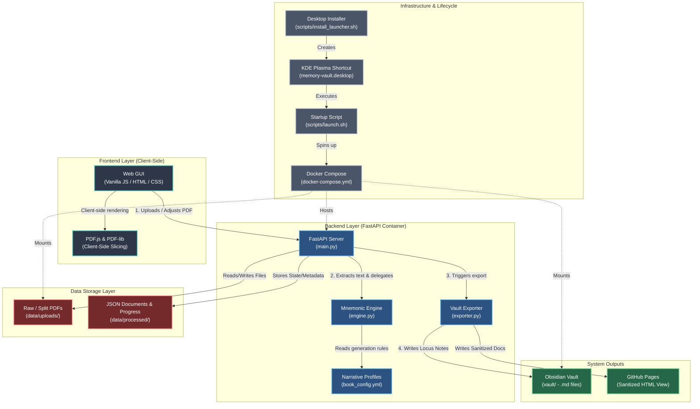

# Anti-Gravity Mnemonic Engine - IT Knowledge Graph

This document provides a high-level overview and architectural knowledge graph of the **Anti-Gravity Mnemonic Engine (Memory Vault)** project. It is intended to significantly reduce the onboarding and reading time for IT and engineering staff.

## System Architecture Knowledge Graph

## Component Breakdown

### 1. Frontend Layer
* **Role**: The main interface for the user to upload textbooks and interactively split chapters.
* **Tech Stack**: Vanilla HTML5, CSS3, JavaScript (ES6).
* **Key Feature**: Offloads heavy PDF splitting to the client browser using `pdf-lib` and `pdf.js` to avoid crashing the backend.

### 2. Backend Layer (Python/FastAPI)
* **Role**: Orchestrates mnemonic generation, text extraction, and exporting.
* **`main.py`**: The REST API entry point routing traffic and managing state (`data/progress.json`).
* **`engine.py`**: The core logic engine that generates cognitive anchors based on subject profiles.
* **`exporter.py`**: Compiles the generated anchors and text into Obsidian Markdown files.
* **`book_config.yml`**: Contains mapping between tech subjects (e.g., Networking) and their sensory mnemonic profiles (e.g., Amphibians, Ambrosia/Ammonia).

### 3. Data Storage (`data/` directory)
* **`uploads/`**: Stores raw user uploads and pre-split chapters.
* **`processed/`**: Stores canonical JSON files representing each ingested chapter and its generated mnemonics.

### 4. System Outputs (`vault/` directory)
* **Locus View**: Output formatted for Obsidian, utilizing collapsible Markdown callouts (`> [!abstract]-`) to hide grotesque anchors until needed.
* **Sanitized View**: Cleaned HTML versions suitable for public portfolios.

### 5. Infrastructure & Lifecycle (`scripts/`)
* **Local-First Containerization**: Uses `docker-compose.yml` to run the FastAPI service locally without exposing it to the web.
* **KDE Desktop Integration**: IT / Users can run `./scripts/install_launcher.sh` once to add a desktop icon. Clicking the icon runs `launch.sh` which ensures Docker is running, spins up the containers, and opens the local web page in the default browser.
